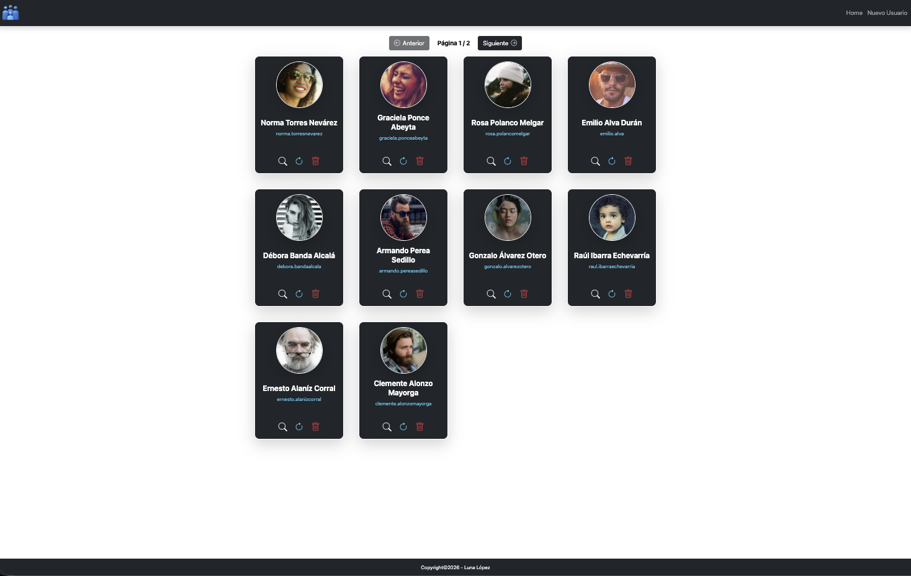
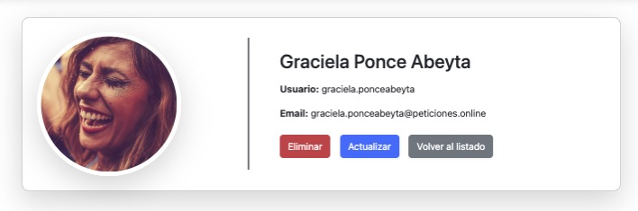
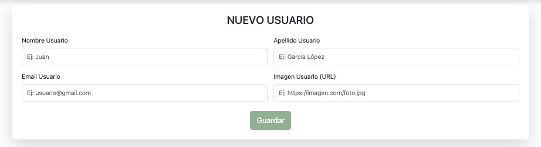
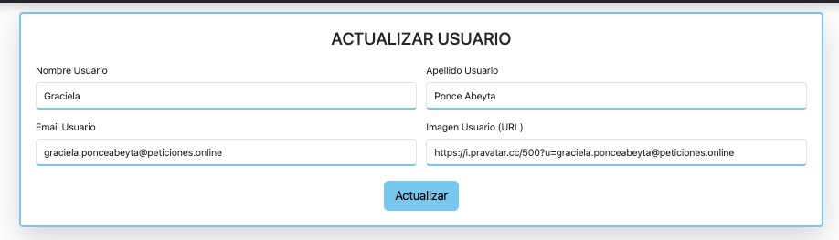

# Usuarios App - Angular CRUD con API
## 1. Introducción

app-usuarios es una aplicación Angular (v21) que implementa un CRUD completo de usuarios mediante una API externa de pruebas. Permite:

- Listar todos los usuarios en un grid responsive.
- Ver detalle de cada usuario.
- Crear un nuevo usuario mediante un formulario con validaciones.
- Actualizar un usuario reutilizando el mismo formulario.
- Eliminar usuarios con confirmación mediante sweetalert2.

El proyecto utiliza Bootstrap 5 para estilos, ngx-sonner para notificaciones toast y signals de Angular para la gestión reactiva de datos.

===
## 2. Objetivos
Consumir una API externa
Implementar un CRUD completo
Usar Angular con Signals
Crear formularios reactivos con validación
Gestionar rutas dinámicas
Aplicar diseño con Bootstrap

===
## 3. Tecnologías
| Tecnología | Uso |
|-----------|------|
| **Angular 21** | Framework principal |
| **TypeScript** | Tipado y lógica |
| **Bootstrap 5** | Estilos y layout |
| **SweetAlert2** | Alertas visuales |
| **ngx-sonner** | Notificaciones toast |
| **API REST** | https://peticiones.online/users |
| **HTML5 / CSS3** 

===
## 4. Estructura del proyecto

src/
│
├─ app/
│   ├─ components/
│   │   └─ user-card/          # Tarjeta individual de usuario con acciones CRUD
│   │
│   ├─ pages/
│   │   ├─ home/               # Listado completo de usuarios
│   │   ├─ user-view/          # Vista detalle usuario
│   │   ├─ user-form/          # Formulario crear/actualizar usuario
│   │   └─ error404/           # Página de error 404
│   │
│   ├─ shared/
│   │   ├─ header/             # Barra de navegación principal
│   │   └─ footer/             # Footer
│   │
│   ├─ services/
│   │   └─ users.service.ts    # Servicio para consumir API externa
│   │
│   ├─ interfaces/
│   │   └─ iuser.interface.ts  # Interfaces IUser e IUserResponse
│   │
│   ├─ app.routes.ts           # Configuración de rutas
│   ├─ app.config.ts           # Configuración de HTTP y signals
│   ├─ app.html                # Layout principal
│   └─ styles.css              # Estilos globales
│
└─ public/
    └─ images/                 # Iconos y fotos de prueba

## 5. Funcionalidades

✔ Listado de usuarios
✔ Vista detalle
✔ Crear usuario
✔ Actualizar usuario
✔ Eliminar usuario
✔ Validación de formulario
✔ Alertas visuales

## 6. Instalación y configuración
1- Clonar el repositorio
```bash
git clone https://github.com/lunalopezdlf/app-usuarios.git
cd app-usuarios
```
2- Instalar dependencias:
```bash
npm install
```
3- Instalar librerías necesarias:
```bash
npm install bootstrap
npm install sweetalert2
npm install ngx-sonner
```
4- Configurar Angular.json para Bootstrap:
```ts
"styles": [
  "node_modules/bootstrap/dist/css/bootstrap.min.css",
  "src/styles.css"
],
"scripts": [
  "node_modules/bootstrap/dist/js/bootstrap.bundle.min.js"
]
```
5- Ejecutar la aplicación:
ng serve -o

## 7. API utilizada
https://peticiones.online/users

## 8. Autora
Luna López

## 9. Vista previa









